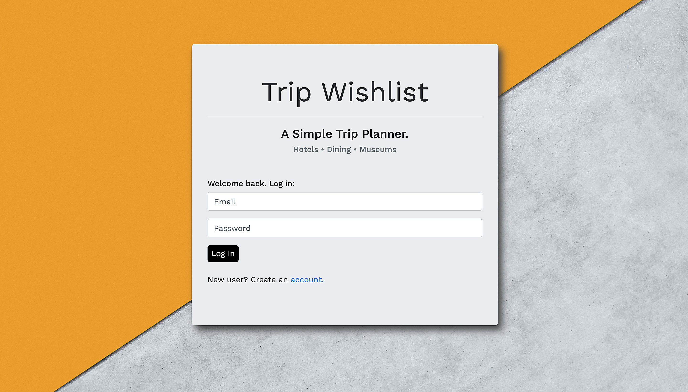
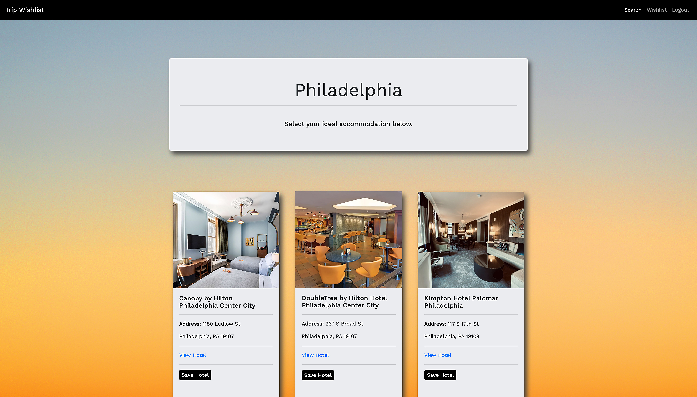
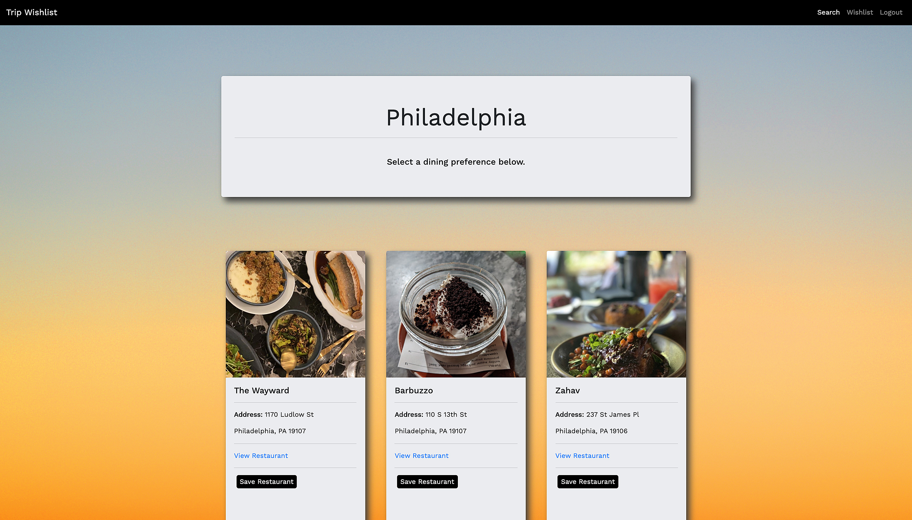
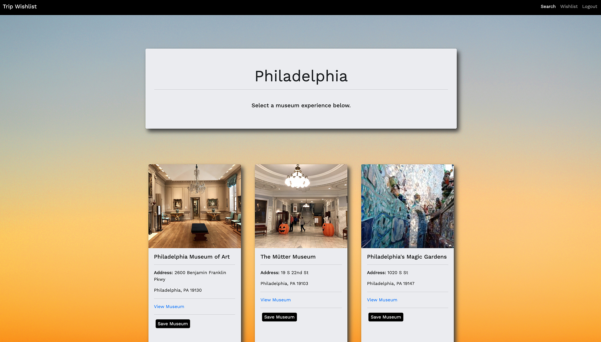
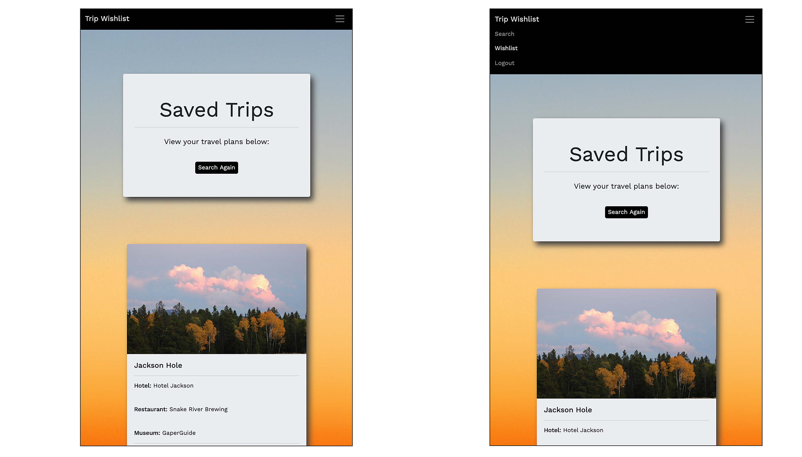

#  Trip Wishlist‏‏‎ ‎‏‏‎ ‎🧳
‏‏‎
‎‎ 

 

      
  

  ---
  
  
&nbsp;

    

## Description 

&nbsp;

<strong><em>What is this project? Why did you make this project? How did you make this project?</strong></em>

&nbsp;

Trip Wishlist is a full stack application for anyone who loves to travel and daydreams about their next adventure. This app allows a user to search cities they'd like to visit, and provides them with a curated selection of listings that are specific to hotel accomodations, restaurant suggestions, and ideas for museums to check out while in town. We wanted to develop a very simple, user-friendly tool for creating a starting wishlist itinerary for future trips. One that makes intial choices for the individual using it and stores those results for them to reference at a later time. This is possible through the use of account creation and authentication, allowing the user to log back in and view their wishlist items. You can think of this as a vacation foundation that gives the user hyperlink resources to navigate outside of the application and further research, if need be.

&nbsp;

View the application here =>‏‏‎ ‎‏‏‎ ‎‏‏‎ ‎‏‏[`Trip Wishlist`](https://trip-wishlist.herokuapp.com/)

&nbsp;

---

&nbsp;

## Table of Contents: 

&nbsp;

* [Usage](#usage)
* [License](#license)
* [Credits](#credits)
* [Contributors](#contributors)
* [Questions](#questions)

&nbsp;

---

&nbsp;

## Usage

&nbsp;

<strong><em>Instructions and examples for usage + development details:</strong></em>

&nbsp;

Visit the application online @ [`Heroku`](https://trip-wishlist.herokuapp.com/) and you'll be greeted with a brief description and the opportunity to create an account, or sign back in if returning. We created a simple two entry field process in an effort to get you searching cities faster. Email + password. We used `Passport.js` to make account creation and authentication a reality, and the `bcrypts.js` password hashing function (to securely store your password). 

&nbsp;

After logging in, you can begin searching cities that are near to you, or across the world. We utilized the `Yelp API` to generate curated results based on the location you entered. This API contains millions of businesses across 32 countries, so rest assured you've got options. After entering your destination, lists of 18 or less will then be displayed for hotels, restaurants and museums. You're able to make a selection within each category, and after you've finished you'll be re-directed to the saved searches section where your wishlist items are waiting for you. They will be stored as long as you'd like, thanks to a `MySQL` database we've made that stores user account information and all of their search selections. When you no longer need one of your city wishlists, feel free to delete it and get back to searching your next trip. This application is responsive and was designed with a mobile-first approach. Feel free to use it on your desktop, tablet, or cellphone.

&nbsp;

---

&nbsp;

View a video overview on usage here:

 

&nbsp;

---

&nbsp;

 

&nbsp;

---

&nbsp;

 

&nbsp;

---

&nbsp;

 

&nbsp;

---

&nbsp;

 

&nbsp;

---

&nbsp;

 

&nbsp;

---

&nbsp;

&nbsp;

---

&nbsp;

## License

&nbsp;

This project is covered under the MIT license. 

&nbsp;

---

&nbsp;

## Credits

&nbsp;

<strong><em>Third party assets:</strong></em>

&nbsp;

`Node.js` =>‏‏‎ ‎ ‏‏‎ ‎[An asynchronous event-driven runtime built on Chrome's V8 JavaScript engine.](https://nodejs.org/en/)

&nbsp;‏‏‎‏‏‎ ‎<strong>+</strong>

`Express.js` =>‏‏‎ ‎ ‏‏‎ ‎[A fast, unopinionated, minimalist web framework for Node.js.](https://expressjs.com/)

&nbsp;‏‏‎‏‏‎ ‎<strong>+</strong>

`MySQL` =>‏‏‎ ‎ ‏‏‎ ‎[The world's most popular open source database.](https://www.mysql.com/)

&nbsp;‏‏‎‏‏‎ ‎<strong>+</strong>

`MySQL npm (2)` =>‏‏‎ ‎ ‏‏‎ ‎[A pure Node.js JavaScript Client implementing the MySQL protocol.](https://www.npmjs.com/package/mysql2)

&nbsp;‏‏‎‏‏‎ ‎<strong>+</strong>

`Sequelize` =>‏‏‎ ‎ ‏‏‎ ‎[A promise-based Node.js ORM (We used w/MySQL).](https://www.npmjs.com/package/sequelize)

&nbsp;‏‏‎‏‏‎ ‎<strong>+</strong>

`Passport.js` =>‏‏‎ ‎ ‏‏‎ ‎[A request authentication node package that uses strategies.](hhttps://www.npmjs.com/package/passport)

&nbsp;‏‏‎‏‏‎ ‎<strong>+</strong>

`jQuery` =>‏‏‎ ‎ ‏‏‎ ‎[The write less, do more, JavaScript library.](https://jquery.com/)

&nbsp;‏‏‎‏‏‎ ‎<strong>+</strong>

`Boostrap / CDN` =>‏‏‎ ‎ ‏‏‎ ‎[The world's most popular framework for building responsive, mobile-first sites.](https://getbootstrap.com/)

&nbsp;‏‏‎‏‏‎ ‎<strong>+</strong>

`bcrypt.js` =>‏‏‎ ‎ ‏‏‎ ‎[A secure password hashing function.](https://www.npmjs.com/package/bcryptjs)

&nbsp;‏‏‎‏‏‎ ‎<strong>+</strong>

`Yelp API` =>‏‏‎ ‎ ‏‏‎ ‎[The best local content and user reviews from millions of businesses across 32 countries.](https://www.yelp.com/developers/)

&nbsp;‏‏‎‏‏‎ ‎<strong>+</strong>

`Heroku` =>‏‏‎ ‎ ‏‏‎ ‎[A platform that enables developers to build, run, & operate applications entirely in the cloud.](https://www.heroku.com)

&nbsp;‏‏‎‏‏‎ ‎<strong>+</strong>

`dotenv npm` =>‏‏‎ ‎ ‏‏‎ ‎[Shhhhhh!](https://www.npmjs.com/package/dotenv)

&nbsp;

---

&nbsp;

## Contributors

&nbsp;

Jen Iglar 
* [GitHub](https://github.com/jeniglar) 
* Email => <jeniglar@gmail.com>

&nbsp;‏‏‎‏‏‎

Josh Trevethan
* [GitHub](https://github.com/JoshTrev) 
* Email =>  <joshj438t@gmail.com>

&nbsp;‏‏‎‏‏‎

Jonathan Schimpf
* [GitHub](https://github.com/jonathanschimpf)
* Email => <jonathan@jonathanschimpf.com>

&nbsp;‏‏‎‏‏‎

Carlos Ramirez
* [GitHub](https://github.com/CarlosR317) 
* Email => <cramire@ycp.edu>

&nbsp;

---

&nbsp;

## Questions?

&nbsp;

Reach out to us via GitHub / Email.

&nbsp;

We'd love to discuss this project with you.

&nbsp;

